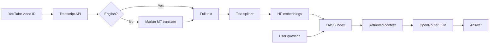

# Video_Query

YouTube Video Query (Language-Aware RAG)

Query YouTube video content in natural language. This project fetches a video’s captions, optionally translates non-English transcripts to English, builds a local vector index, and answers questions using retrieval-augmented generation (RAG) with an LLM.

The workflow is implemented in [`Youtube_language_query.ipynb`](Youtube_language_query.ipynb).

## What it does

1. **Fetch transcript** — Uses [`youtube-transcript-api`](https://github.com/jdepoix/youtube-transcript-api) to pull captions for a given `video_id`, with fallbacks when the default track is missing.
2. **Detect & translate** — Uses `langdetect` and Helsinki-NLP Marian models (`opus-mt-{lang}-en`) to detect language and translate non-English text to English in chunks.
3. **Chunk & embed** — Splits transcript text with LangChain’s `RecursiveCharacterTextSplitter`, then embeds chunks with **Hugging Face** `sentence-transformers/all-MiniLM-L6-v2` (runs locally, no API key).
4. **Vector store** — Stores embeddings in a **FAISS** index for similarity search.
5. **Q&A** — Retrieves top-k relevant chunks and sends them to **OpenRouter** via LangChain’s `ChatOpenAI` (`openai/gpt-3.5-turbo`), answering only from provided context.

## Architecture



## Requirements

- Python 3.9+
- An [OpenRouter](https://openrouter.ai/) API key (OpenAI-compatible; keys start with `sk-or-`)
- Internet for: YouTube transcripts, Hugging Face model downloads, OpenRouter API

No API key is required for embeddings or translation models (they download from Hugging Face on first use).

## Setup

1. Clone or download this repository.

2. Create your environment file:

   ```bash
   cp .env.example .env
   ```

   Edit `.env` and set:

   | Variable | Description |
   |----------|-------------|
   | `OPENAI_API_KEY` | Your OpenRouter API key |
   | `OPENAI_BASE_URL` | `https://openrouter.ai/api/v1` |

3. Install dependencies (also run in the notebook):

   ```bash
   pip install python-dotenv youtube-transcript-api langchain langchain-community \
     langchain-text-splitters langchain-openai faiss-cpu sentence-transformers \
     transformers sentencepiece langdetect langcodes language_data tqdm
   ```

4. Open `Youtube_language_query.ipynb` and run cells in order.

## Configuration

- **Video**: Change `video_id` in the transcript cell (example in notebook: `CAgWNxlmYsc`).
- **Chunking**: `chunk_size=800`, `chunk_overlap=150` in the splitter cell.
- **Retrieval**: `k=4` similar chunks in the retriever.
- **LLM**: `openai/gpt-3.5-turbo` via OpenRouter, `temperature=0.2`.

## Example question

The notebook demonstrates asking whether nuclear fusion is discussed in the video and what was said—answers are grounded in retrieved transcript snippets only.

## Project structure

```
Youtube_video_query/
├── Youtube_language_query.ipynb   # Main pipeline
├── .env.example                   # Template for secrets
├── .env                           # Your keys (not committed; see .gitignore)
├── .gitignore
└── README.md
```

## Limitations

- Requires captions on the YouTube video (`TranscriptsDisabled` if none).
- Translation quality depends on language support in Marian `opus-mt-*-en` models.
- Large transcripts increase memory use for FAISS and embedding.
- Answers are only as good as the retrieved chunks and caption accuracy.

