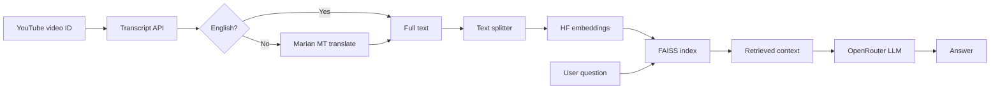

# Video_Query

Query any YouTube video in plain English — without watching the whole thing.

Give it a **video ID** and a **question** (e.g. *"Is nuclear fusion discussed? What was said?"*). The project reads the video’s captions, finds the parts that match your question, and returns an answer based only on what was actually said in the video.

## What it does

**Problem:** YouTube videos are long. Finding whether a specific topic is covered means scrubbing through or reading the entire transcript yourself.

**Solution:** This tool automates that. It:

1. **Downloads the caption transcript** for a YouTube video (the same text you see when you turn on subtitles).
2. **Translates to English** if the captions are in another language (e.g. Hindi, Spanish).
3. **Breaks the transcript into small chunks** and converts each chunk into a searchable vector (embedding).
4. **Builds a search index (FAISS)** so it can quickly find chunks related to your question.
5. **Answers your question** using an LLM (GPT-3.5 via OpenRouter), but **only using the retrieved transcript text** — not general internet knowledge.

So the answer comes from the video’s captions, not from the model guessing.

**Example:** For a science video, you can ask *"Was CRISPR mentioned? What did they say about it?"* and get a summary pulled from the relevant parts of the transcript.

## How it works

1. Fetch YouTube captions → full transcript text  
2. Detect language → translate to English if needed  
3. Split text into chunks → embed with Hugging Face (local, free)  
4. Store vectors in FAISS → similarity search  
5. Your question → find top 4 matching chunks → LLM writes the answer from that context only

## Architecture



## Setup

```bash
git clone https://github.com/san376/Video_Query.git
cd Video_Query
cp .env.example .env
```

Add your OpenRouter key to `.env`:

```env
OPENAI_API_KEY=your-key-here
OPENAI_BASE_URL=https://openrouter.ai/api/v1
```

Install dependencies:

```bash
pip install python-dotenv youtube-transcript-api langchain langchain-community langchain-text-splitters langchain-openai faiss-cpu sentence-transformers transformers sentencepiece langdetect langcodes language_data tqdm
```

## Run

```bash
python run_all.py
```

This runs all scripts in `code/` in order (01 → 22).

## Project structure

```
Video_Query/
├── run_all.py          # Runs the full pipeline
├── code/               # Pipeline scripts (01–22)
├── .env.example        # API key template
└── README.md
```

## Config

Edit these in the `code/` scripts:

| Setting | File | Default |
|---------|------|---------|
| Video ID | `03_fetch_transcript.py` | `CAgWNxlmYsc` |
| Question | `17_question.py` | nuclear fusion example |
| Chunk size | `06_split_chunks.py` | 800 / 150 overlap |
| LLM model | `15_llm.py` | `openai/gpt-3.5-turbo` |

## Notes

- Video must have captions available
- Embeddings and translation run locally (Hugging Face)
- Only the LLM step needs an OpenRouter API key
